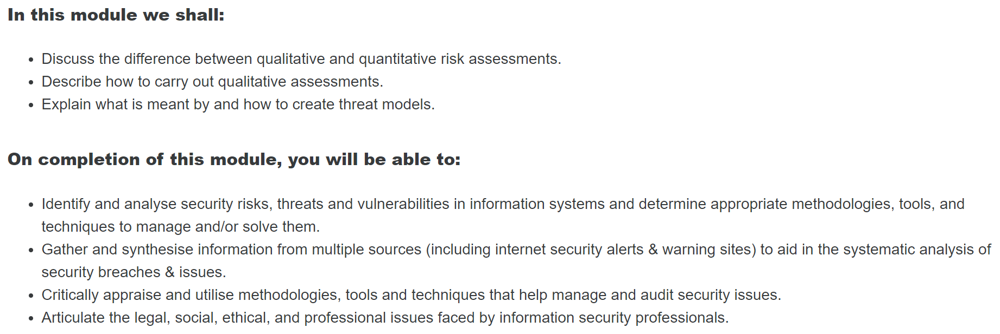
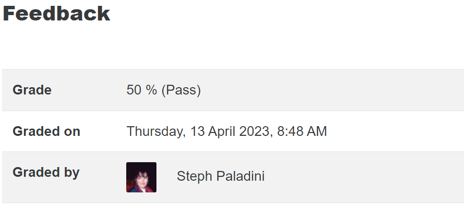
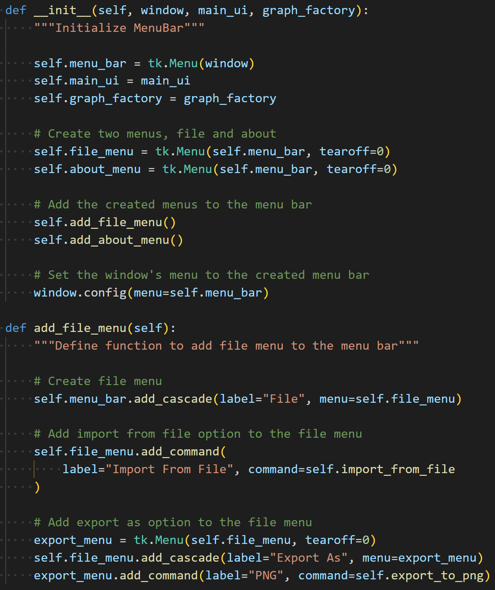
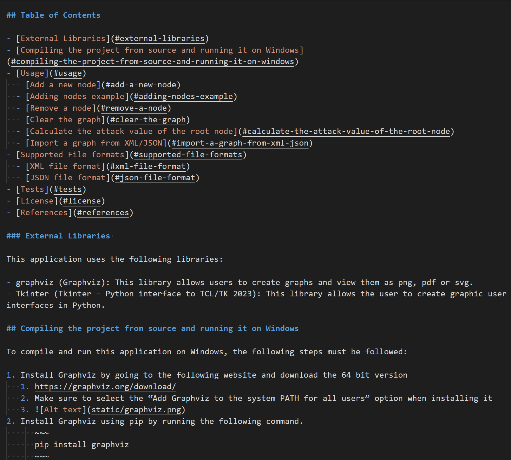

## What

This unit has focused on security and threat modelling, Security standards, Disaster recovery, and Risk management. This has been a fascinating unit. It expanded on everything I learned in Network Security which was the previous unit. Every week leading up to the first assignment, which was due in week 3, has taught me something new which aided me in completing the first assignment. 

 

The first assignment was interesting because it tasked me to create a risk assessment report on evaluating the risks for a given business to digitize its operation and the alternative of maintaining its current way of operating. I started this assignment like I start all my assignments by first researching everything I can on risk assessment reports and the standards such reports use. After my research, I concluded that I would use the DREAD and STRIDE methodology for this risk assessment report. This part of the assignment was successful. However, one of the most significant issues I faced was the 600-word count limit. This was a real problem since I had already reached that limit by completing only a single part of the assignment. I spent the next hour or so trying to minimize what I had written. This was successful to an extent. I was able to drop the word count to 500 words. Not a significant drop but a drop nonetheless. The next step was to write my recommendation. Sadly, due to the limited 100-word limit, I could not write everything I wanted for the recommendation section. Furthermore, I completely missed on the fact that I needed to provide a Gant chart for this assignment. Due to this and a few other issues, I only received a passing grade when I expected a Merit. This was really disheartening since this has been the lowest grade I have received since I started my master's degree.

## So What

While the below-than-expected grade was disheartening, I could do nothing about it other than do my best to get a better grade for the following assessment. I read my feedback and created a plan to improve my work for the next assignment. I was excited about the final assignment since it required me to develop a Python application allowing the user to create an attack tree. I was determined to get a minimum of a Distinction to make up for the passing grade. However, sadly my workload after the first assessment was really high. I work two full-time jobs. I work as a CTO in a software company and teach as a game lecturer at one of the local institutes where I live. I usually can handle this load, including doing my master's. However, due to a time-sensitive project, I could not work on my master's degree at all. This has caused me to fall significantly behind. While I was able to finish 90% of the application requirements, there was still the last 10% of the application left, plus writing my final reflection and the final modified risk report. Therefore I needed to ask for an extension.

The application needed to read either an XML (Introduction to XML) or JSON (Introducing json) file format and produce a graph and save it on disk. However, since I wanted to go above and beyond what the assignment required, I created a GUI interface and allowed the user to create and export a graph using it. Furthermore, I allowed the user to load both XML and JSON file formats and display the graph in the application. This assignment was really fun, and I enjoyed it quite a bit. I used Graphviz (Graphviz) library to do all the graph creation parts of the application and Tkinter (Tkinter - Python interface to TCL/TK 2023) to do all the GUI parts. I have never used either library before, and learning about them was really fun. The next step was to create unit tests. While I fully understand why this part is necessary, it is my least favourite part of this process.

## Now what
Now that I have finished everything required for this project, I have a few things to reflect on and improve.

I need to spend more at least one hour a day doing work on my masters no matter what kind of deadlines I have. I think the best time for this is early in the morning.
I should meet with my advisor at least once a week to get feedback on my assignment before submitting it.

I think doing the above two points should be a good start. In addition, I have learnt how to write a good markdown file this trimester. I have always wanted to know how to do this but never had the chance to learn it. So this trimester I took the time to do that. Furthermore, now I also know how to write a proper risk management report.

## References:

Introduction to XML. Available at: https://www.w3schools.com/xml/xml_whatis.asp. 

Introducing JSON. Available at: https://www.json.org/json-en.html. 

Graphviz (2023) Graphviz. Available at: https://graphviz.org/.

Tkinter - Python interface to TCL/TK Python documentation. Available at: https://docs.python.org/3/library/tkinter.html.